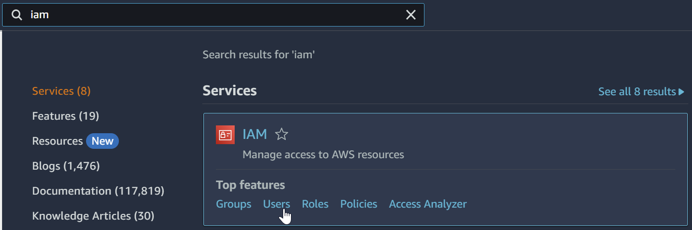
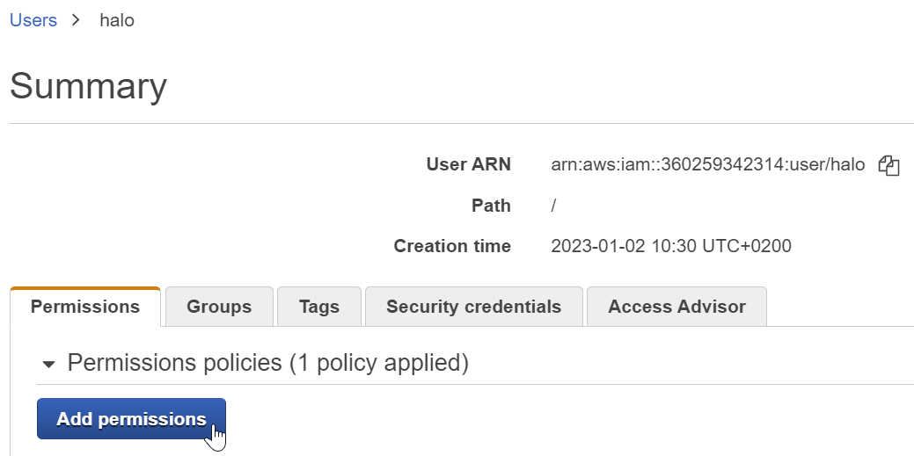
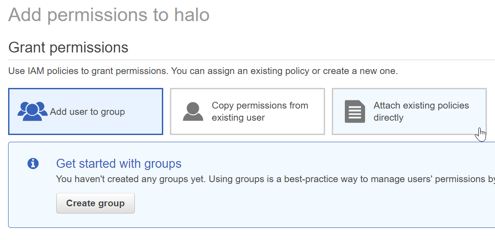
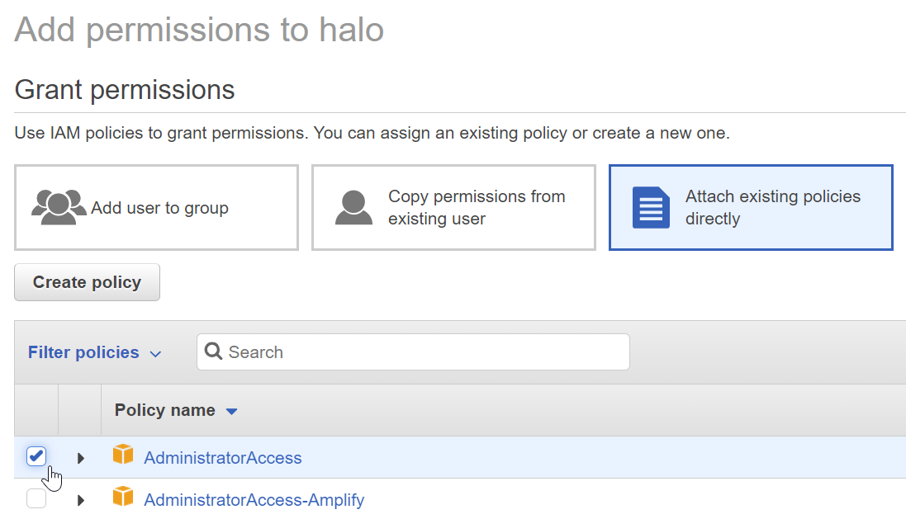

# How to provide AWS IAM user with administrative permissions

Open users in IAM console:

Click on the user you wish to change policies for (`halolab-eugene`). Click "Add permissions" button:

Select "Attach existing policies directly":

Check the "AdministratorAccess" checkbox:

Click the "Next: Review" button and after that click the "Add permissions" button (both at the bottom of the page).